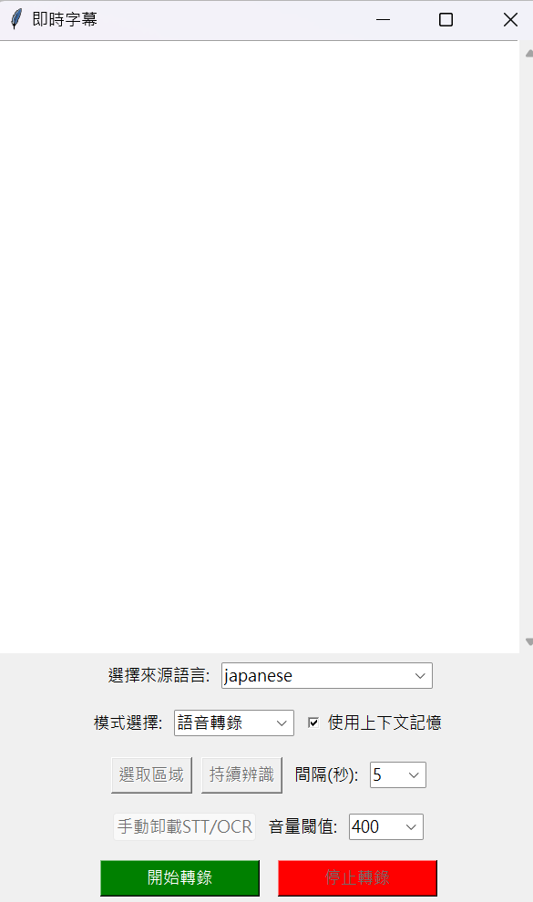
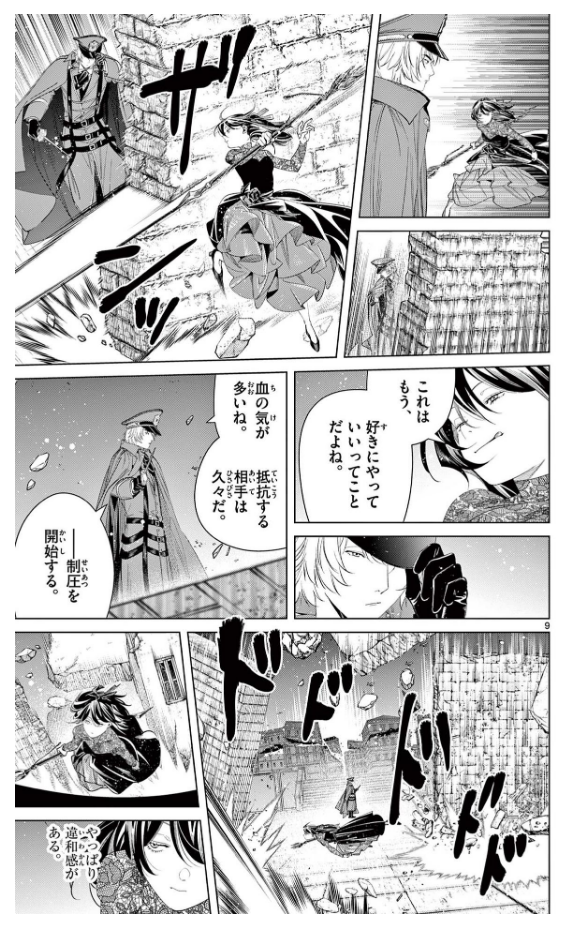
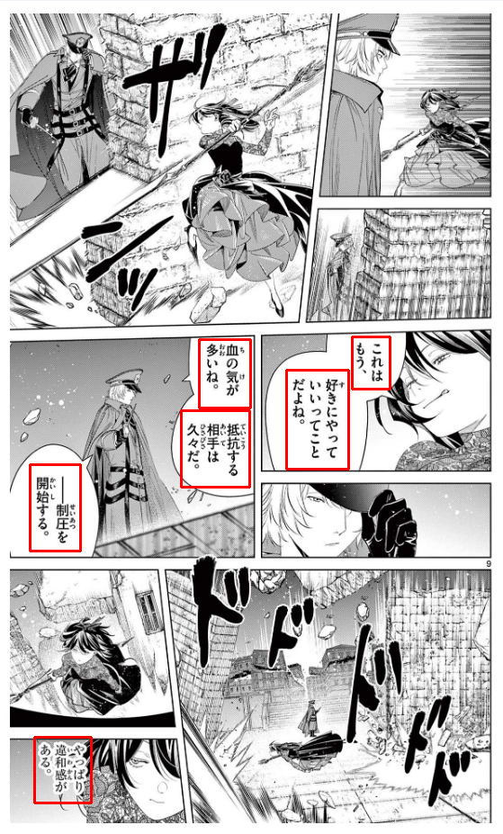
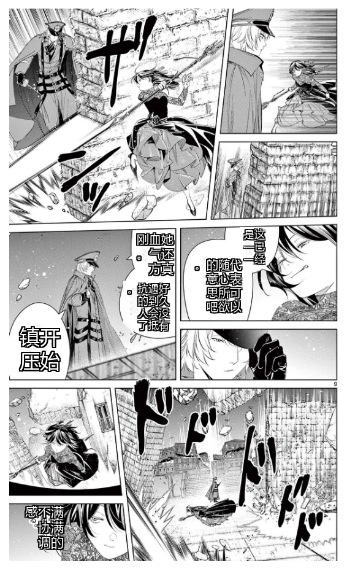
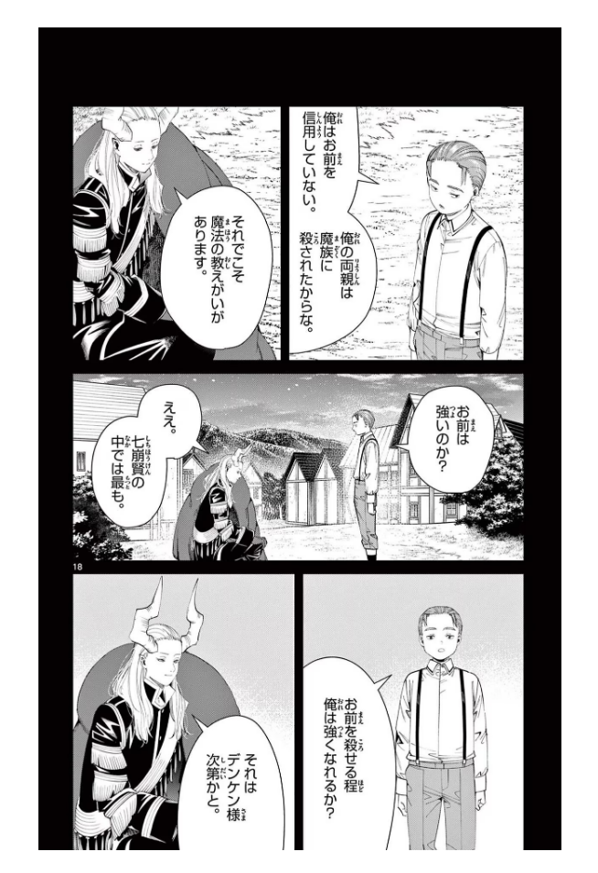
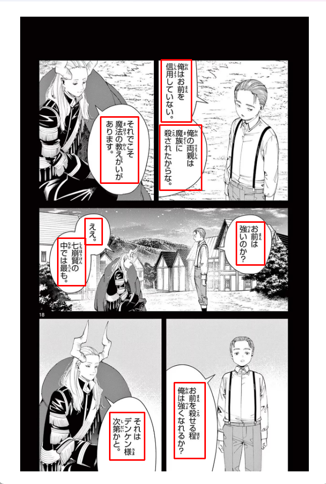
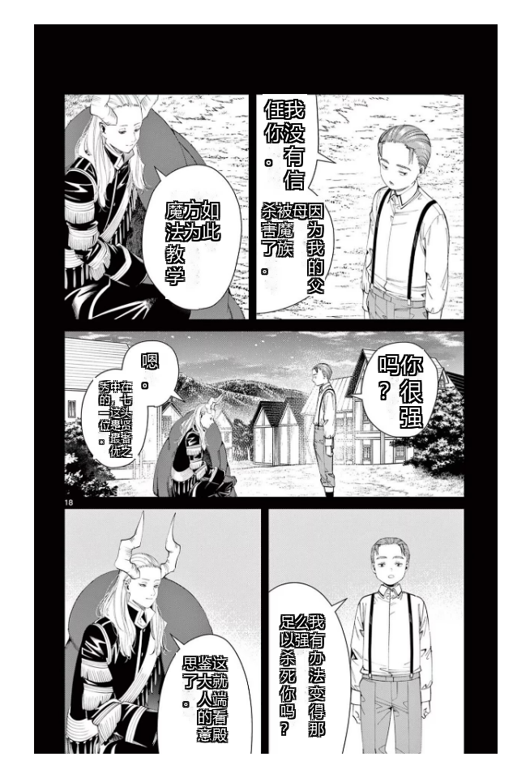

# Real-time-Translation
基於whisper-large、PaddleOCR、Sakura-Qwen2.5的即時翻譯

前期準備:

1.先安裝vb cable  

2.設定 > 系統 > 音效 > 更多音效設定 > 錄製 > 找到CABLE Output > 右鍵CABLE Output > 內容 > 接聽 > 聆聽此裝置 > 確定保存後退出

每次使用翻譯前將音效輸出裝置設定成CABLE Input即可使用

同時運行whisper-large-turbo、sakura-7b-qwen2.5-q6k需10G顯存

同時運行sakura-7b-qwen2.5-q6k、qwen2.5vl:7b-q4_K_M需10G顯存

[SakuraLLM](https://huggingface.co/SakuraLLM)
## whisper和Sakura-Qwen2.5本地路徑自行更改，模型大小依照顯存自行決定
建議whisper-large-turbo或以上，建議Sakura-Qwen2.5 7B-Q4或以上

## 上傳圖片的模式下也可以用ollama運行VLM替代OCR
普通模式下文字背景沒漫畫那麼雜的話OCR完全夠用，所以只做上傳圖片的時候可替代，運行VLM替代OCR建議qwen2.5vl:7b-q4_K_M或以上

## GUI

|  |  |  |

|  |  |  |
