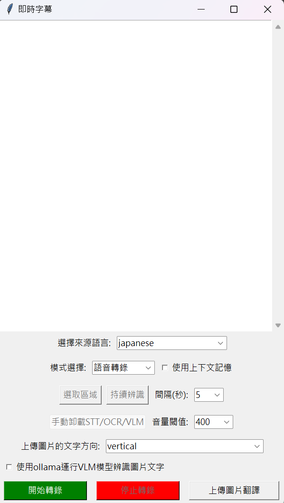

# Real-time-Translation
基於whisper-large和Sakura-Qwen2.5的即時翻譯

前期準備:

1.先安裝vb cable  

2.設定 > 系統 > 音效 > 更多音效設定 > 錄製 > 找到CABLE Output > 右鍵CABLE Output > 內容 > 接聽 > 聆聽此裝置 > 確定保存後退出

每次使用翻譯前將音效輸出裝置設定成CABLE Input即可使用

## whisper和Sakura-Qwen2.5本地路徑自行更改，模型大小依照顯存自行決定
建議whisper-large-turbo以上，建議Sakura-Qwen2.5 7B-Q4以上

## GUI

